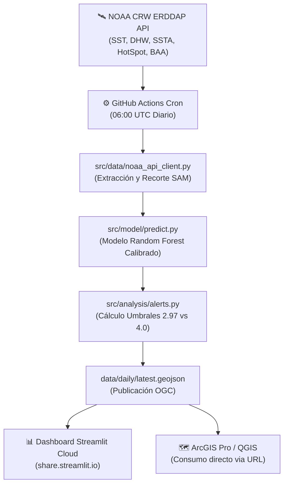

# 🐠 SAM Coral Bleaching Monitor

**Sistema de Monitoreo, Alerta Temprana y Calibración Regional de Estrés Térmico en el Sistema Arrecifal Mesoamericano (SAM)**

[](https://share.streamlit.io)
[](https://opensource.org/licenses/MIT)
[](https://www.python.org/downloads/)
[](https://coralreefwatch.noaa.gov/)

---

## 📌 Resumen del Proyecto

Este proyecto implementa una plataforma geoespacial automatizada para la detección temprana de eventos de blanqueamiento de coral en las costas de **México, Belice, Guatemala y Honduras**.

A diferencia de los modelos satelitales globales que aplican un umbral genérico de estrés térmico (**4.0 °C·semanas** en DHW), este sistema integra observaciones biológicas *in situ* con modelos de aprendizaje supervisado (**Random Forest**) para aplicar un **umbral regionalmente calibrado de 2.97 °C·semanas**, incrementando la sensibilidad de alerta previa a la ocurrencia de mortandad masiva.

### 🌟 Innovaciones Clave
1. **Calibración Regional (2.97 °C·sem):** Anticipa la emisión de alertas tempranas frente al umbral global estándar de NOAA.
2. **Descarga y Procesamiento Serverless:** Conexión directa con la API ERDDAP de NOAA Coral Reef Watch (v3.1, 5km), eliminando la necesidad de descargas manuales de miles de archivos NetCDF.
3. **Automatización Diaria (GitHub Actions):** Se ejecuta diariamente a las 06:00 UTC (medianoche en Centroamérica), procesa los datos y actualiza las capas del dashboard sin requerir servidores locales encendidos.
4. **Interoperabilidad OGC:** Exporta capas abiertas en GeoJSON listas para ser consumidas directamente en **ArcGIS Pro**, **QGIS** y la aplicación web interactiva en **Streamlit**.
5. **Arquitectura Replicable:** Configurable para cualquier región arrecifal del mundo mediante un único archivo central (`config.yaml`).

---

## 🏛️ Arquitectura del Sistema



---

## 📂 Estructura del Repositorio

```text
SAM-Coral-Dashboard/
├── .github/
│   └── workflows/
│       └── daily_update.yml          # Flujo automatizado de actualización diaria en GitHub Actions
├── config.yaml                       # Parámetros centrales, coordenadas BBox y umbrales regionales
├── requirements.txt                  # Dependencias de Python para el pipeline y dashboard
├── LICENSE                           # Licencia de código abierto MIT
├── README.md                         # Documentación general
│
├── data/
│   ├── static/
│   │   └── AREA_SAM.geojson          # Polígono geográfico del área de estudio (SAM)
│   ├── models/
│   │   └── RF_Model_v2_corrected.pkl # Modelo serializado calibrado
│   └── daily/
│       ├── latest.geojson            # Capa vectorial activa más reciente para visualización
│       └── latest_summary.json       # Métricas e indicadores diarios en formato JSON
│
└── src/
    ├── data/
    │   ├── noaa_api_client.py        # Conexión programática a NOAA ERDDAP
    │   ├── insitu_processor.py       # Procesamiento y calidad de datos CoralWatch/Fundaeco
    │   └── feature_engineering.py    # Extracción de métricas térmicas del día de observación
    ├── model/
    │   ├── train_rf.py               # Entrenamiento con validación temporal y espacial
    │   ├── validate.py               # Métricas científicas (PR-AUC, ROC-AUC, Youden's J)
    │   └── predict.py                # Inferencia geoespacial sobre grillas térmicas
    ├── analysis/
    │   ├── alerts.py                 # Lógica de clasificación de alertas NOAA vs SAM
    │   ├── time_series.py            # Análisis de series temporales y Sen's slope
    │   ├── spatial_stats.py          # Agregación y estadísticas por país
    │   └── thermal_refugia.py        # Identificación y cartografía de refugios térmicos
    ├── dashboard/
    │   ├── app.py                    # Aplicación web interactiva en Streamlit
    │   ├── map_layers.py             # Capas cartográficas interactivas (Folium/Leafmap)
    │   ├── charts.py                 # Gráficos dinámicos con Plotly
    │   └── publish.py                # Exportación y publicación de productos diarios
    └── pipeline/
        └── daily_pipeline.py         # Orquestador del flujo de trabajo diario
```

---

## 🚀 Instalación y Uso Local

### 1. Clonar el repositorio
```bash
git clone https://github.com/mercyaguilar22/SAM-Coral-Dashboard.git
cd SAM-Coral-Dashboard
```

### 2. Crear un entorno virtual e instalar dependencias
```bash
python -m venv venv
# En Windows:
.\venv\Scripts\activate
# En Linux/macOS:
source venv/bin/activate

pip install --upgrade pip
pip install -r requirements.txt
```

### 3. Ejecutar el Dashboard Localmente
```bash
streamlit run src/dashboard/app.py
```
Abre tu navegador en `http://localhost:8501`.

### 4. Ejecutar el Pipeline Diario Manualmente
```bash
# Para el día de ayer:
python -m src.pipeline.daily_pipeline

# Para una fecha específica:
python -m src.pipeline.daily_pipeline --date 2024-08-15
```

---

## 🌐 Despliegue en Streamlit Cloud

Para desplegar este dashboard de forma pública y gratuita:

1. Ve a [share.streamlit.io](https://share.streamlit.io) e inicia sesión con tu cuenta de GitHub (`mercyaguilar22`).
2. Haz clic en **Create app** -> **Deploy a public app from GitHub**.
3. Selecciona:
   - **Repository:** `mercyaguilar22/SAM-Coral-Dashboard`
   - **Branch:** `main`
   - **Main file path:** `src/dashboard/app.py`
   - **App URL:** `sam-coral-dashboard` (o el subdominio que elijas)
4. Haz clic en **Deploy!**

Cada vez que el cron de GitHub Actions actualice `data/daily/latest.geojson`, Streamlit Cloud refrescará los datos automáticamente.

---

## 🗺️ Interoperabilidad con ArcGIS Pro

Para consumir las alertas en vivo directamente en tus proyectos de **ArcGIS Pro**:

1. En ArcGIS Pro, pestaña **Insert** ➔ **Add Data** ➔ **Data From Path**.
2. Pega la URL del GeoJSON en vivo:
   ```text
   https://raw.githubusercontent.com/mercyaguilar22/SAM-Coral-Dashboard/main/data/daily/latest.geojson
   ```
3. O mediante Python en el Notebook de ArcGIS Pro:
   ```python
   import arcpy
   url = "https://raw.githubusercontent.com/mercyaguilar22/SAM-Coral-Dashboard/main/data/daily/latest.geojson"
   arcpy.conversion.JSONToFeatures(url, "in_memory/alertas_sam_en_vivo")
   ```

---

## 🌍 Replicabilidad en Otras Regiones

Para replicar este flujo de trabajo en cualquier otro arrecife (ej. Gran Barrera de Coral, Triángulo de Coral, etc.):
Edita únicamente el archivo [`config.yaml`](config.yaml):
- Modifica el `name`, `shapefile` y las coordenadas `bbox` (lat_min, lat_max, lon_min, lon_max).
- Define el `regional_optimized` threshold específico de esa región.
- Ejecuta el pipeline: todo el procesamiento se adaptará a las nuevas coordenadas automáticamente.

---

## 📜 Licencia y Citación

Este proyecto se distribuye bajo la licencia **MIT**. Consulta el archivo [LICENSE](LICENSE) para más detalles.

**Citación recomendada:**
> Aguilar Maas, M. G. (2025). *Optimización de alertas de blanqueamiento coralino mediante Random Forest y calibración regional en el Sistema Arrecifal Mesoamericano*. Tesis de Maestría en Ingeniería Geomática, Universidad de San Carlos de Guatemala.
